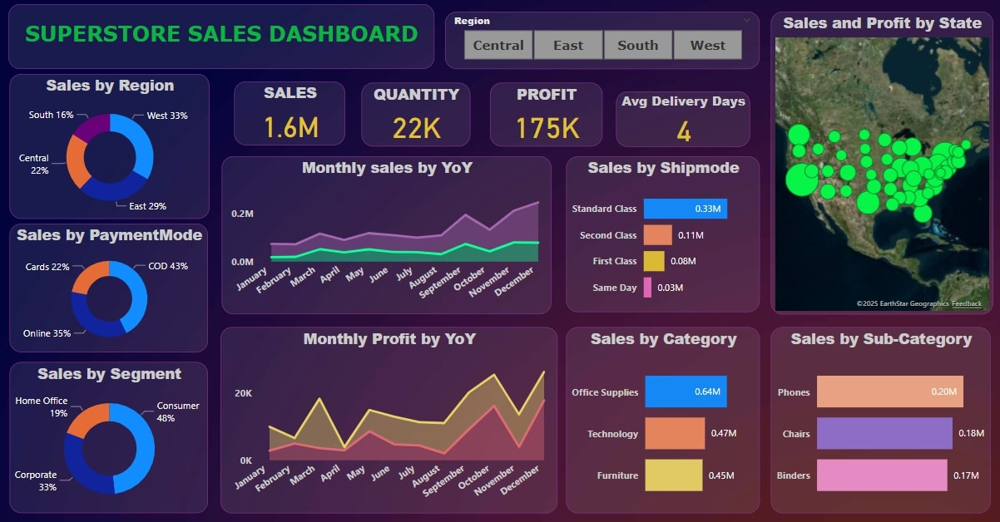

  

# 🛍️ Superstore Sales Analytics Dashboard  

## 📊 Overview  
The **Superstore Sales Analytics Dashboard** is a **Power BI-driven analytical solution** designed to help businesses **unlock data-driven insights** and optimize their **sales performance, customer behavior, and operational efficiency**.  

This dashboard provides a **360-degree view** of key metrics such as **total sales, profit, shipping trends, payment methods, customer segments, and regional performance**, empowering businesses to make informed decisions and drive growth.  

---

## 🔍 Business Challenges  
Retail and e-commerce businesses often face **multiple challenges** in managing sales, customer demand, and profitability. Below are some common pain points:  

❌ **Inconsistent Sales Growth** – Difficulty in identifying revenue-generating trends and seasonal demand patterns.  
❌ **Inventory & Stock Issues** – Overstocking or understocking due to poor demand forecasting.  
❌ **Delivery & Logistics Inefficiencies** – High shipping delays affecting customer satisfaction and retention.  
❌ **Customer Segmentation Gaps** – Inability to accurately target profitable customer segments.  
❌ **Profitability Concerns** – No clear breakdown of profits across regions and product categories.  

---

## 🚀 Business Solutions Provided  
To tackle these challenges, this **Superstore Sales Analytics Dashboard** offers:  

✅ **Data-Driven Sales Strategy** – Insights into **monthly/yearly sales trends** to drive data-backed decision-making.  
✅ **Optimized Inventory Management** – Identify **high-selling** and **low-performing products** to adjust stock levels.  
✅ **Enhanced Shipping & Delivery Performance** – Breakdown of **average delivery times** and **shipping modes** to minimize delays.  
✅ **Customer Segmentation & Targeting** – Analyze customer purchasing behavior based on **segments, payment methods, and regions**.  
✅ **Profitability Maximization** – Identify the **most profitable categories, regions, and customer segments** for better resource allocation.  

---

## 📈 Key Insights from the Dashboard  
🔹 **Sales & Profitability Trends** – The dashboard reveals seasonal trends and year-over-year growth to track performance effectively.  
🔹 **Regional Sales Performance** – Sales distribution across regions helps identify areas with high/low revenue generation.  
🔹 **Customer Buying Patterns** – Analyzing payment methods, order volume, and customer segments allows businesses to enhance personalized marketing efforts.  
🔹 **Product Performance Analysis** – Identifies top-selling products and underperforming categories to make data-driven inventory decisions.  
🔹 **Shipping & Logistics Overview** – Evaluates the impact of different shipping modes on delivery times and customer satisfaction.  

---

---

## 🛠️ Technologies Used  
- **Power BI** – Interactive data visualization & dashboard creation  
- **SQL** – Data extraction, transformation & aggregation  
- **Excel** – Data preprocessing & analysis  

---

## 📌 Why This Dashboard Matters  
This **Superstore Sales Analytics Dashboard** helps businesses **streamline operations, boost revenue, and enhance customer satisfaction** by providing clear, actionable insights. Companies can use it to:  

📊 **Optimize sales & marketing strategies** by analyzing revenue trends.  
🛒 **Improve customer experience** with better shipping & payment methods.  
📦 **Enhance supply chain & logistics** with efficient shipping mode insights.  
💰 **Maximize profit margins** by focusing on high-performing categories & regions.  

---

## 🤝 Let's Connect!  
📩 Email: [arundeepp9393@gmail.com](mailto:arundeepp9393@gmail.com)  
🔗 LinkedIn: [linkedin.com/in/arun](https://www.linkedin.com/in/arun-deep-04964b258/)  
💻 GitHub: [github.com/ArunCooksData](https://github.com/ArunCooksData)  

🚀 **Turn Data into Business Growth with Actionable Insights!**  
